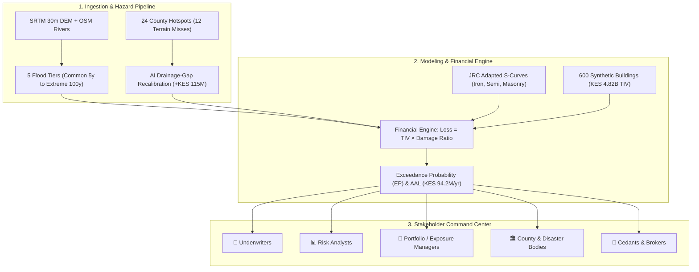

# Kenya Re Nairobi Urban Flood CAT Model: Stakeholder User Flows & Architecture

**Per Problem Statement (Team A · Nairobi Urban Surface-Water Flood)**  
**Target Peril:** Pluvial / Surface-Water Flooding across Nairobi County  
**Core Pipeline:** Hazard (5 Tiers) → Vulnerability (JRC S-Curves) → Exposure (600 Synthetic Assets) → Financial Engine (EP Curve / PML / AAL) + AI Innovation Layer

---

## 1. End-to-End Stakeholder Ecosystem Architecture

---

## 2. Dedicated User Flows by Stakeholder Role

```mermaid
flowchart LR
    subgraph UF1["👔 Underwriter User Flow"]
        U_Start["Receive Submission"] --> U_Intake["AI Free-Text Policy Ingestion"]
        U_Intake --> U_Lookup["Auto-Geocode & Hazard Depth Lookup"]
        U_Lookup --> U_Pricing["Calculate 100-Yr Loss & Deductibles"]
        U_Pricing --> U_Quote["Issue Defensible Quote Slip"]
    end

    subgraph UF2["📊 Risk Analyst User Flow"]
        RA_Start["Model Calibration"] --> RA_Vuln["Inspect JRC Depth-Damage S-Curves"]
        RA_Vuln --> RA_Sim["Run 5-Tier Return Period Simulation"]
        RA_Sim --> RA_EP["Analyze EP Curve & Calculate AAL"]
        RA_EP --> RA_Audit["Verify Model Assumptions & Audit Log"]
    end

    subgraph UF3["🏢 Portfolio Manager User Flow"]
        PM_Start["Portfolio Monitoring"] --> PM_Map["Explore 3D Nairobi Spatial Risk Map"]
        PM_Map --> PM_Accum["Detect TIV Accumulation Clusters (River Basins)"]
        PM_Accum --> PM_Stress["Run 1-in-100 PML Stress Test (KES 842.6M)"]
        PM_Stress --> PM_Sublimit["Set Housing Class Sub-Limits (Iron Sheet)"]
    end

    subgraph UF4["🏛️ County & Disaster Agency Flow"]
        CD_Start["Disaster Planning"] --> CD_Hotspots["Inspect 24 Official Hotspots"]
        CD_Hotspots --> CD_Gaps["Audit 12 Drainage Failure Zones (Kibera, Westlands)"]
        CD_Gaps --> CD_Vulnerable["Pinpoint Informal Settlements in Floodway"]
        CD_Vulnerable --> CD_Action["Prioritize Stormwater Culvert Clearing"]
    end

    subgraph UF5["🤝 Cedant & Broker User Flow"]
        CB_Start["Treaty Placement"] --> CB_PML["Review Model 1-in-100 PML"]
        CB_PML --> CB_Layer["Structure XOL Treaty Attachment (1-in-10y)"]
        CB_Layer --> CB_AI["Review AI Solvency Adjustment (+KES 115M)"]
        CB_AI --> CB_Export["Export Executive Reinsurance Memorandum"]
    end
```

---

## 3. Stakeholder Requirements Breakdown

| Stakeholder Role | Primary Questions They Ask | Platform Action & Entrypoint | Output Delivered |
| :--- | :--- | :--- | :--- |
| **👔 Underwriters** | *"How much should I charge for this property? What is its 1-in-100 year flood loss?"* | `+ Price New Policy` (NLP Ingestion) + Single Property Dossier | Structured policy line, instantaneous flood depth, calculated deductible (2.5%), and pure risk rate. |
| **📊 Risk Analysts** | *"Are our vulnerability functions defensible? What is the annual expected portfolio burn?"* | `Inspect JRC Vulnerability Curves` + `Exceedance Probability (EP)` view | S-curves across 3 housing classes (capped at 85%-90%), EP spline curve, and AAL (KES 94.2M/yr). |
| **🏢 Portfolio / Exposure Managers** | *"Where is our insured capital concentrated? How much loss comes from informal iron sheet?"* | `3D Spatial Risk Map` + Housing Class Filters + 100-Yr PML KPI | Spatial accumulation clusters along Mathare/Ngong rivers; iron sheet sub-limit warning (15% TIV = 42% loss). |
| **🏛️ County & Disaster Bodies** | *"Which neighborhoods flood due to drainage failure rather than natural low ground?"* | `AI Drainage Audit` + `24 Hotspots Visible` | Detection of 12 infrastructure bottleneck zones (Kibera, Westlands, Lavington); culvert intervention priorities. |
| **🤝 Cedants & Brokers** | *"Where should the Excess of Loss (XOL) treaty attach? Is Kenya Re capital adequate?"* | `Overlay DEM Baseline vs AI` + `Export Underwriting Brief` | XOL attachment at 1-in-10y (KES 238.9M), treaty exhaustion at KES 842.6M, executive reinsurance memorandum download. |

