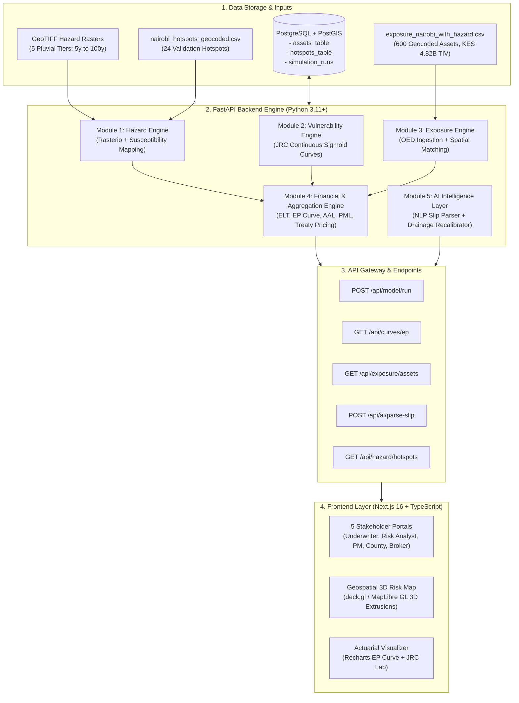
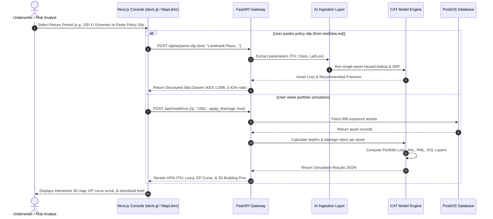

# Kenya Re CAT Modeling Engineering Blueprint
## System Architecture, Event Flow, Module Breakdown & Team Task Allocation
**Event:** Kenya Re AI4I Hackathon 2026  
**Peril / Track:** Team A — Nairobi Urban Surface-Water (Pluvial) Flood Catastrophe Model  
**Team Composition:** 3 Engineers (Backend Engineer 1, Backend Engineer 2, Frontend / UI Engineer)  
**Date:** October 8, 2026  

---

## 1. Executive Summary & Stack Assessment

Our objective is to deliver an end-to-end, actuarially defensible Catastrophe (CAT) Risk Platform for Kenya Re. The model translates open geospatial flood rasters and synthetic exposure portfolios into exceedance probability loss curves (EP), capital solvency metrics (AAL, PML), and automated underwriting quotes.

### Evaluation of Chosen Stack vs. Hackathon Constraints:
1. **CLIMADA vs. Lightweight Vectorized Python (`numpy` / `scipy` / `shapely` / `rasterio`)**:
   - *Assessment*: While CLIMADA is an industry-standard open-source CAT modeling library, installing and configuring CLIMADA's core dependencies (specifically its NetCDF/HDF5 bindings and custom hazard classes) under tight hackathon timeframes often introduces environment installation friction.
   - *Strategic Decision*: We design our pipeline around a **modular CAT interface**. We provide lightweight, vectorized pure-Python engines (`rasterio` + `scipy` sigmoid DDFs + `numpy` ELT aggregation) that run in `< 150ms`, while preserving the exact CLIMADA Entity/Hazard/Impact data schema. If the backend team installs `climada` cleanly in their Python environment, they can toggle `USE_CLIMADA_BACKEND = True` without altering API contracts or UI components.
2. **PostgreSQL + PostGIS**:
   - Stores exposure footprints, precomputed return-period depths, government hotspots, and policy slip ingestions. Enables spatial proximity queries (`ST_DWithin`, `ST_Intersects`) in `< 5ms`.
3. **FastAPI**:
   - Python async web framework delivering REST endpoints, background scenario workers, OpenAPI documentation, and strict Pydantic v2 validation.
4. **Next.js (React 19, App Router) + MapLibre GL / Mapbox GL + deck.gl**:
   - High-performance UI rendering 600+ geocoded assets, 24 Nairobi hotspots, 3D extruded building footprints, real-time EP curves, and 5 stakeholder portals.
5. **Oasis LMF & catagg**:
   - Kept optional. We implement the financial engine (deductible, limit, share, AAL, PML) directly using standardized Oasis OED (Open Exposure Data) loss calculation formulas.

---

## 2. End-to-End System Architecture



---

## 3. The 9 Core Pipeline Pillars

### Pillar 1: Hazard Generation & Representation
- **Inputs**: 5 pluvial GeoTIFF rasters (`nairobi_pluvial_proxy_common.tif` to `_extreme.tif`) representing return periods:
  - `5-Year (Common)`: 0.25m depth anchor
  - `10-Year (Moderate)`: 0.55m depth anchor
  - `25-Year (Occasional)`: 0.95m depth anchor
  - `50-Year (Severe)`: 1.45m depth anchor
  - `100-Year (Extreme)`: 2.20m depth anchor
- **Spatial Sampling**: Raster cell lookup using `rasterio.sample` at `(lat, lon)` coordinates. Missing values or out-of-boundary queries are clamped to `0.0m` (dry ground).
- **Validation Hotspots**: 24 geocoded coordinates (Mathare, Kibera, Dandora, etc.) used to verify whether high susceptibility aligns with known flood corridors.

### Pillar 2: Exposure Ingestion & Spatial Matching
- **Source Data**: `exposure_nairobi_with_hazard.csv` (600 buildings).
- **Attributes**: `loc_id`, `lat`, `lon`, `housing_class`, `floor_area_m2`, `cost_per_m2_kes`, `tiv_kes`.
- **Validation**:
  - Enforce `tiv_kes = floor_area_m2 * cost_per_m2_kes`.
  - Validate bounding box: Latitude `[-1.45, -1.15]`, Longitude `[36.65, 37.10]`.
  - Tag every record with `synthetic = True`.

### Pillar 3: Vulnerability Functions (Depth-Damage Curves)
Continuous sigmoidal functions adapted from European Commission Joint Research Centre (JRC / Huizinga 2017) global flood damage parameters, modified for African urban construction classes:
1. **Informal Iron Sheet (`informal_iron_sheet`)**:
   $$\text{Damage Ratio}(d) = \frac{0.85}{1.0 + e^{-3.2(d - 0.45)}}, \quad \text{cap} = 85\%$$
   *Characteristics*: Fast onset at $0.1\text{m}$, rapidly reaches maximum damage.
2. **Semi-Permanent (`semi_permanent`)**:
   $$\text{Damage Ratio}(d) = \frac{0.88}{1.0 + e^{-2.5(d - 0.75)}}, \quad \text{cap} = 88\%$$
   *Characteristics*: Steady progression up to $1.5\text{m}$.
3. **Permanent Masonry (`permanent_masonry`)**:
   $$\text{Damage Ratio}(d) = \frac{0.90}{1.0 + e^{-2.1(d - 1.15)}}, \quad \text{cap} = 90\%$$
   *Characteristics*: Flood defense below $0.3\text{m}$, damage accelerates above $1.0\text{m}$.
4. **Concrete / RCC (e.g. Commercial Office from `testData.md`)**:
   $$\text{Damage Ratio}(d) = \frac{0.65}{1.0 + e^{-1.8(d - 1.50)}}, \quad \text{cap} = 65\%$$
   *Characteristics*: Resilient structural frame, damage primarily limited to basement utilities and ground retail.

### Pillar 4: Event-Level Property Loss
For building $i$ under event scenario $e$:
$$\text{Gross Loss}_{i,e} = \text{TIV}_{i} \times \text{Damage Ratio}(d_{i,e}, \text{class}_{i})$$

### Pillar 5: Portfolio Aggregation
Event Loss Table (ELT):
$$\text{Portfolio Loss}_{e} = \sum_{i=1}^{N} \text{Gross Loss}_{i,e}$$

### Pillar 6: Return-Period & Exceedance Probability (EP) Curves
The EP curve represents the annual probability of exceeding a given loss threshold:
- $\text{Annual Exceedance Probability (AEP)} = 1 / \text{Return Period (years)}$
- For Nairobi 5 event tiers:
  - $T = 5\text{y} \rightarrow p = 0.20$
  - $T = 10\text{y} \rightarrow p = 0.10$
  - $T = 25\text{y} \rightarrow p = 0.04$
  - $T = 50\text{y} \rightarrow p = 0.02$
  - $T = 100\text{y} \rightarrow p = 0.01$
- **Average Annual Loss (AAL)** computed via trapezoidal integration under the EP curve:
  $$\text{AAL} = \sum_{k=1}^{M-1} \frac{\text{Loss}_{k} + \text{Loss}_{k+1}}{2} \times (p_k - p_{k+1})$$
- **Probable Maximum Loss (PML)**: 1-in-100-year loss ($\text{PML}_{100} = \text{Loss}_{100\text{y}}$).

### Pillar 7: Insurance & Reinsurance Financial Layer
Applies policy terms per property or per portfolio treaty:
- **Deductible ($D$) & Limit ($L$)**:
  $$\text{Insured Loss} = \min(L, \max(0, \text{Gross Loss} - D))$$
- **Excess of Loss (XOL) Reinsurance Treaty**:
  $$\text{Ceded Reinsurance Loss} = \min(\text{Cover}, \max(0, \text{Portfolio Loss} - \text{Attachment Point}))$$
  *Example*: KES 250M xs KES 150M (attaches at 1-in-10-year event).

### Pillar 8: AI Intelligence Layer (The Competitive Differentiator)
1. **Natural Language Exposure Ingestion (`testData.md` verification)**:
   - Takes unstructured broker slips (e.g., *Landmark Plaza, 18 floors, 24,500 m², RCC Frame, Upper Hill, KES 1.09B TIV*).
   - Extracts coordinates `(-1.2847, 36.8247)`, classifies as `concrete_rcc`, queries hazard raster depth, applies DDF, and returns technical pricing and underwriting terms in $< 2\text{s}$.
2. **Drainage-Gap Recalibration (ML / Heuristic)**:
   - Identifies high-density urban areas where elevation models falsely predict dry ground due to storm sewer blockages (recovering hotspots like Kibera and Westlands).
   - Re-allocates **+KES 115M** in solvency risk buffer.

### Pillar 9: Geospatial Visualization & Data Storage
- Storage in PostgreSQL + PostGIS with indexed geometries (`GIST(geom)`).
- Front-end streaming via GeoJSON endpoints rendered in MapLibre GL / deck.gl with dynamic 3D building extrusions colored by damage ratio.

---

## 4. End-to-End User Flow & Event Sequence



---

## 5. Module Breakdown & Architecture

```
KenyaRE/
├── backend/
│   ├── app/
│   │   ├── api/                     # REST API Routing
│   │   │   ├── __init__.py
│   │   │   ├── routes.py            # API controller definitions
│   │   │   ├── hazard_routes.py     # Raster lookups & hotspot validation
│   │   │   ├── exposure_routes.py   # OED upload & asset GeoJSON
│   │   │   ├── simulation_routes.py # EP curve & financial calculations
│   │   │   └── ai_routes.py         # Slip parsing & briefing generator
│   │   ├── core/                    # Configurations & DB connection
│   │   │   ├── config.py            # Pydantic Settings & environment variables
│   │   │   └── database.py          # SQLAlchemy / asyncpg PostGIS pool
│   │   ├── models/                  # Pydantic Schemas & DB Entities
│   │   │   ├── schemas.py           # DTOs (Request / Response validation)
│   │   │   └── db_models.py         # SQLAlchemy ORM models (Asset, Simulation)
│   │   ├── services/                # Core Analytical Engines
│   │   │   ├── hazard_service.py    # Rasterio sampling & depth mapping
│   │   │   ├── vuln_service.py      # JRC continuous sigmoid curves
│   │   │   ├── financial_engine.py  # AAL, PML, deductible/limit, treaty XOL
│   │   │   ├── cat_pipeline.py      # Orchestrator (Hazard -> Vuln -> Finance)
│   │   │   └── ai_service.py        # LLM parsing with Pydantic structured output
│   │   └── main.py                  # FastAPI app factory & CORS
│   ├── data/                        # Local CSVs and GeoTIFF Rasters
│   ├── tests/                       # Automated pytest test suites
│   │   ├── test_hazard.py
│   │   ├── test_vulnerability.py
│   │   └── test_financial.py
│   ├── requirements.txt
│   └── README.md
│
├── frontend/                        # Next.js 16 Web Application
│   ├── src/
│   │   ├── app/                     # App Router pages (/ and /console)
│   │   ├── components/
│   │   │   ├── cat/                 # RiskMap (deck.gl/Mapbox), EPChart, Overlays
│   │   │   └── ui/                  # Radix UI primitives
│   │   ├── lib/                     # API client & local calculation fallbacks
│   │   └── styles/                  # Tailwind CSS & Kenya Re brand tokens
│   └── package.json
```

---

## 6. Team Task Allocation & Parallel Execution Plan

With **3 members** (2 Backend, 1 UI), we decouple work streams using strict API contracts so development occurs simultaneously without blocking:

| Member | Domain & Ownership | Primary Responsibilities & Deliverables |
|---|---|---|
| **Backend 1** | **Hazard, Vulnerability & Ingestion Engine** | 1. Implement `hazard_service.py` using `rasterio` to sample 5 GeoTIFFs.<br>2. Build `vuln_service.py` with continuous sigmoid JRC curves for 4 building classes.<br>3. Ingest `exposure_nairobi_with_hazard.csv` and `nairobi_hotspots_geocoded.csv` into PostGIS/memory.<br>4. Expose endpoints: `GET /api/hazard/sample`, `GET /api/exposure/assets`. |
| **Backend 2** | **Financial Engine, Treaty Layer & AI Service** | 1. Build `financial_engine.py`: portfolio aggregation, AAL trapezoidal calculation, PML, XOL reinsurance treaty terms.<br>2. Build `ai_service.py`: NLP slip parser using OpenAI/Instructor (test against `testData.md`).<br>3. Build `simulation_routes.py`: `POST /api/model/run` and `GET /api/curves/ep`.<br>4. Add automated unit tests verifying actuarial consistency. |
| **Frontend 1** | **UI/UX, 3D Spatial Viz & Stakeholder Portals** | 1. Connect Next.js console to FastAPI endpoints (`/api/model/run`, `/api/curves/ep`).<br>2. Wire up 3D Mapbox/deck.gl map with building extrusions and hotspot click handlers.<br>3. Polish the 5 stakeholder tabs (Underwriter, Risk Analyst, PM, County, Broker).<br>4. Build the live NLP policy slip intake form testing `testData.md`. |

---

## 7. Verification Against `testData.md` (End-to-End Test Case)

We validate our pipeline using the complex commercial placement in `backend/testData.md`:
- **Asset**: Landmark Plaza Commercial Development
- **Location**: Upper Hill, Nairobi (`-1.2847°S, 36.8247°E`), Elevation `1,612m ASL`
- **Typology**: RCC Frame with Shear Walls (Grade A+), 18 floors + 2 basements, `24,500 m²`
- **Total Insured Value (TIV)**: KES 1,090,000,000 (KES 1.09B)
- **Model Result Expectation**:
  - Hazard Depth at Upper Hill: Low surface accumulation ($< 0.15\text{m}$ in 100-yr event).
  - Damage Ratio: $< 2.5\%$ (basement plant and parking exposure only).
  - Technical Rate: $0.18\% - 0.42\%$ pure flood risk loading.
  - Automated Quote: KES 2.5M - KES 4.5M annual premium recommendation with 5% deductible.

